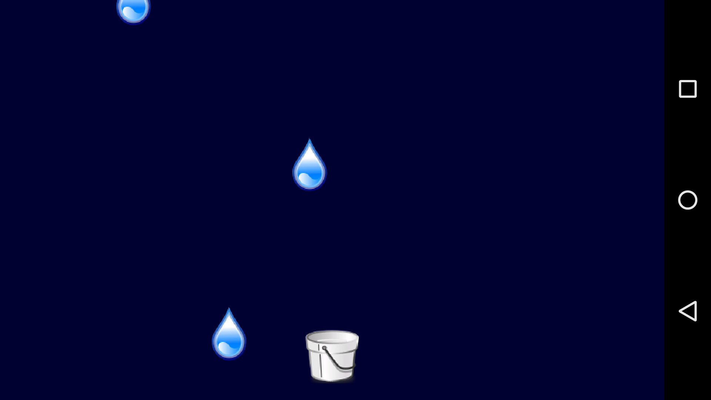
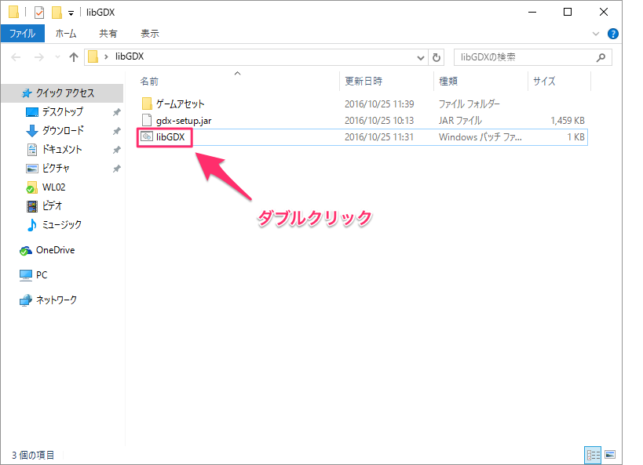
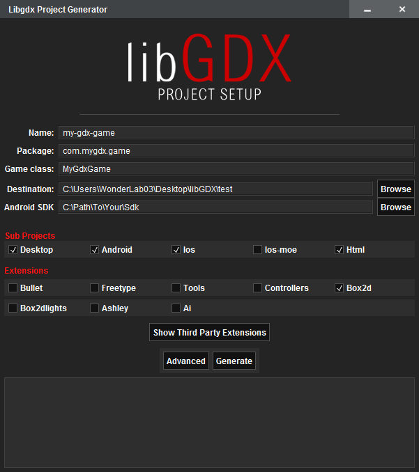
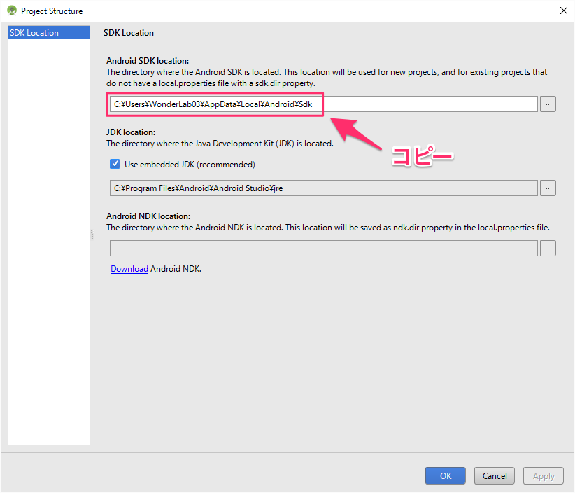
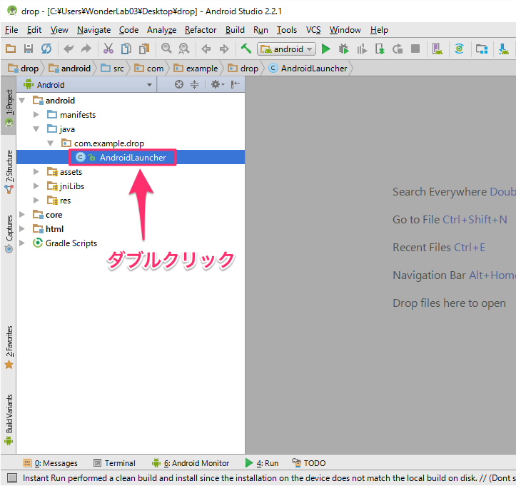
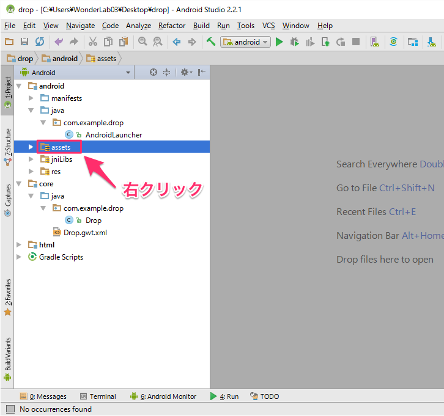
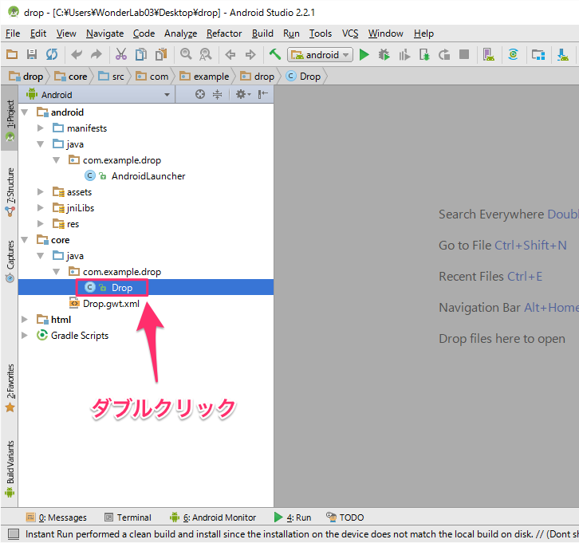

# ゲーム完成イメージ



画面をタップしてバケツを移動し、落ちてくる雨をキャッチするゲーム！

参考元: <a href="https://github.com/libgdx/libgdx/wiki/A-simple-game">A simple game (ligGDX)</a>

## 準備
1. [Android Studio](https://developer.android.com/studio/index.html?hl=ja)(バージョン2.2以上)をインストール
2. JAVA_HOME環境変数を設定する
 * 例: C¥Program Files¥Android¥Android Studio¥jre
3. <a href="./libGDX.zip">ゲーム作成ツール(libGDX.zip)</a>をダウンロードして展開する

## ゲームプロジェクトを作成
1. 「準備」の3で展開したフォルダ中の libGDX.bat ファイルをダブルクリックする(画像参照)<br/>

2. 以下のウィンドウが起動する:<br/>

3. Android Studioを起動し、「File > Other Settings > Default Project Structure...」をクリック
4. Android SDK location のパスをコピーする(画像参照)<br/>

5. 2で起動したウィンドウに以下の内容を入力する:
 * Name: __drop__
 * Package: __com.example.drop__
 * Game class: __Drop__
 * Destination: <span style="color: #e74c3c;">各自プロジェクトを保存する場所を指定</span>
 * Android SDK: <span style="color: #e74c3c;">4でコピーしたパスをペースト(貼り付け)</span>
 * Sub Projects: **Android**のみチェック
 * Extensions: すべてのチェックを外す
6. Generateボタンをクリックして、プロジェクト作成(しばらく時間がかかります)

## プロジェクトを開く
1. Android Studioを起動する
2. 「File > Open...」をクリック
3. 「ゲームプロジェクトを作成」の5のDestinationで指定した場所を選択して、「OK」をクリック
4. 新しいウィンドウが開き、プロジェクトが表示される

## スタータークラスを設定する
1. Android Studioのプロジェクトタブから`AndroidLauncher.java`を探し出し、ダブルクリック(画像参照)<br/>

2. `AndroidLauncher.java`の`onCreate`メソッドを以下のように変更する:

``` java
package com.example.drop;

import android.os.Bundle;

import com.badlogic.gdx.backends.android.AndroidApplication;
import com.badlogic.gdx.backends.android.AndroidApplicationConfiguration;

public class AndroidLauncher extends AndroidApplication {
	@Override
	protected void onCreate (Bundle savedInstanceState) {
		super.onCreate(savedInstanceState);
		AndroidApplicationConfiguration config = new AndroidApplicationConfiguration();
		config.useAccelerometer = false;
		config.useCompass = false;
		initialize(new Drop(), config);
	}
}
```

追加した`config.useAccelerometer = false;`は加速度センサーを使用しないための設定で、`config.useCompass = false;`はGPSを使用しないための設定です。

## ゲームアセットの追加
1. Android Studioのプロジェクトタブから__assets__フォルダを探し出し、右クリック(画像参照)<br/>

2. 表示されたポップアップ中の__Show in Explorer__をクリック

## ゲームコード
ゲーム中で使用するアセット(画像や効果音など)を読み込みます。
1. Android Studioのプロジェクトタブから`Drop.java`を探し出し、ダブルクリック(画像参照)<br/>


## ソースコード全体
今回作成したゲームの全ソースコードは以下の通りです:
### `AndroidLauncher.java`
``` java
package com.example.drop;

import android.os.Bundle;

import com.badlogic.gdx.backends.android.AndroidApplication;
import com.badlogic.gdx.backends.android.AndroidApplicationConfiguration;

public class AndroidLauncher extends AndroidApplication {
	@Override
	protected void onCreate (Bundle savedInstanceState) {
		super.onCreate(savedInstanceState);
		AndroidApplicationConfiguration config = new AndroidApplicationConfiguration();
		config.useAccelerometer = false;
		config.useCompass = false;
		initialize(new Drop(), config);
	}
}
```
### `Drop.java`
```java
package com.example.drop;

import java.util.Iterator;

import com.badlogic.gdx.ApplicationAdapter;
import com.badlogic.gdx.Gdx;
import com.badlogic.gdx.Input.Keys;
import com.badlogic.gdx.audio.Music;
import com.badlogic.gdx.audio.Sound;
import com.badlogic.gdx.graphics.GL20;
import com.badlogic.gdx.graphics.OrthographicCamera;
import com.badlogic.gdx.graphics.Texture;
import com.badlogic.gdx.graphics.g2d.SpriteBatch;
import com.badlogic.gdx.math.MathUtils;
import com.badlogic.gdx.math.Rectangle;
import com.badlogic.gdx.math.Vector3;
import com.badlogic.gdx.utils.Array;
import com.badlogic.gdx.utils.TimeUtils;

public class Drop extends ApplicationAdapter {
   private Texture dropImage;
   private Texture bucketImage;
   private Sound dropSound;
   private Music rainMusic;
   private SpriteBatch batch;
   private OrthographicCamera camera;
   private Rectangle bucket;
   private Array<Rectangle> raindrops;
   private long lastDropTime;

   @Override
   public void create() {
      // 64ピクセル x 64ピクセルの雨粒とバケツの画像を読み込みます
      dropImage = new Texture(Gdx.files.internal("droplet.png"));
      bucketImage = new Texture(Gdx.files.internal("bucket.png"));

      // 水滴の効果音と雨のBGMを読み込みます
      dropSound = Gdx.audio.newSound(Gdx.files.internal("drop.wav"));
      rainMusic = Gdx.audio.newMusic(Gdx.files.internal("rain.mp3"));

      // 雨のBGMを再生します
      rainMusic.setLooping(true);
      rainMusic.play();

      // カメラとSpriteBatchを生成します
      camera = new OrthographicCamera();
      camera.setToOrtho(false, 800, 480);
      batch = new SpriteBatch();

      // バケツをプログラムで扱うための四角形を生成します
      bucket = new Rectangle();
      bucket.x = 800 / 2 - 64 / 2; // 横方向の中心にバケツを配置します
      bucket.y = 20; // バケツの左下が画面下端から20ピクセル離れた位置になるように配置します
      bucket.width = 64;
      bucket.height = 64;

      // 雨粒用の配列を生成し、最初の雨粒を生成します
      raindrops = new Array<Rectangle>();
      spawnRaindrop();
   }

   private void spawnRaindrop() {
      Rectangle raindrop = new Rectangle();
      raindrop.x = MathUtils.random(0, 800-64);
      raindrop.y = 480;
      raindrop.width = 64;
      raindrop.height = 64;
      raindrops.add(raindrop);
      lastDropTime = TimeUtils.nanoTime();
   }

   @Override
   public void render() {
      // スクリーンをダーク・ブルーに塗りつぶします。
      // glClearColorの引数は、赤/緑/青/透明度の4つで、
      // 0から1の範囲の小数でします。指定した色が画面色になります。
      Gdx.gl.glClearColor(0, 0, 0.2f, 1);
      Gdx.gl.glClear(GL20.GL_COLOR_BUFFER_BIT);

      // カメラ用の配列をアップデートします
      camera.update();

      // SpriteBatchに、カメラで指定された座標系に
      // レンダリングするよう命令します
      batch.setProjectionMatrix(camera.combined);

      // 新しいバッチを開始して、バケツとすべての雨粒を描画します
      batch.begin();
      batch.draw(bucketImage, bucket.x, bucket.y);
      for(Rectangle raindrop: raindrops) {
         batch.draw(dropImage, raindrop.x, raindrop.y);
      }
      batch.end();

      // ユーザーの入力を処理します
      if(Gdx.input.isTouched()) {
         Vector3 touchPos = new Vector3();
         touchPos.set(Gdx.input.getX(), Gdx.input.getY(), 0);
         camera.unproject(touchPos);
         bucket.x = touchPos.x - 64 / 2;
      }

      // バケツが画面内に留まるように制御します
      if(bucket.x < 0) bucket.x = 0;
      if(bucket.x > 800 - 64) bucket.x = 800 - 64;

      // 新しい雨粒を生成すべきかチェックします
      if(TimeUtils.nanoTime() - lastDropTime > 1000000000) spawnRaindrop();

      // 雨粒を下に動かします。
      // 画面下端に到達した雨粒や、バケツに触れた雨粒は削除します。
      // 雨粒がバケツに触れた場合は、水滴の効果音を再生します。
      Iterator<Rectangle> iter = raindrops.iterator();
      while(iter.hasNext()) {
         Rectangle raindrop = iter.next();
         raindrop.y -= 200 * Gdx.graphics.getDeltaTime();
         if(raindrop.y + 64 < 0) iter.remove();
         if(raindrop.overlaps(bucket)) {
            dropSound.play();
            iter.remove();
         }
      }
   }

   @Override
   public void dispose() {
      // 読み込んだリソースを破棄します
      dropImage.dispose();
      bucketImage.dispose();
      dropSound.dispose();
      rainMusic.dispose();
      batch.dispose();
   }
}
```

## ゲームアセット
* 雨粒画像
 * https://www.box.com/s/peqrdkwjl6guhpm48nit
* バケツ画像
 * https://www.box.com/s/605bvdlwuqubtutbyf4x
* 水滴が落ちる音 ([CC 3.0](https://creativecommons.org/licenses/by/3.0/))
 * http://www.freesound.org/people/junggle/sounds/30341/
* 雨の音 ([CC 3.0](https://creativecommons.org/licenses/by/3.0/))
 * http://www.freesound.org/people/acclivity/sounds/28283/
