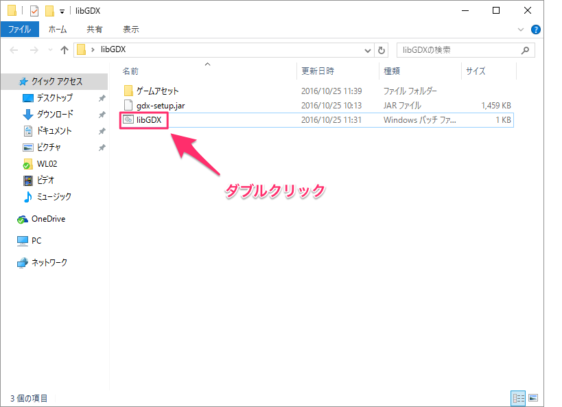

# ゲーム完成イメージ


画面をタップしてバケツを移動し、落ちてくる雨をキャッチするゲーム！

参考元: <a href="https://github.com/libgdx/libgdx/wiki/A-simple-game">A simple game (ligGDX)</a>

## 準備
1. [Android Studio](https://developer.android.com/studio/index.html?hl=ja)をインストール
2. JAVA_HOME環境変数を設定する
 * 例: C¥Program Files¥Android¥Android Studio¥jre
3. <a href="./libGDX.zip">ゲーム作成ツール(libGDX.zip)</a>をダウンロードして展開する

## ゲームプロジェクトを作成
1. 「準備」の3で展開したフォルダ中の libGDX.bat ファイルをダブルクリックする(画像参照)

2. 以下のウィンドウが起動する:
3. Android Studioを起動し、「File > Other Settings > Default Project Structure...」をクリック
4. Android SDK location のパスをコピーする(画像参照)
5. 2で起動したウィンドウに以下の内容を入力する:
 * Name: drop
 * Package: com.example.drop
 * Game class: Drop
 * Destination: <span style="color: #e74c3c;">各自プロジェクトを保存する場所を指定</span>
 * Android SDK: <span style="color: #e74c3c;">4でコピーしたパスをペースト(貼り付け)</span>
 * Sub Projects: **Android**のみチェック
 * Extensions: すべてのチェックを外す
6. Generateボタンをクリックして、プロジェクト作成(しばらく時間がかかります)

## プロジェクトを開く
1. Android Studioを起動する
2. 「File > Open...」をクリック
3. 「ゲームプロジェクトを作成」の5のDestinationで指定した場所を選択して、「OK」をクリック
4. 新しいウィンドウが開き、プロジェクトが表示される


## ソースコード全体
すべてのDropクラスのコードは以下の通りです:
```java
package com.badlogic.drop;

import java.util.Iterator;

import com.badlogic.gdx.ApplicationAdapter;
import com.badlogic.gdx.Gdx;
import com.badlogic.gdx.Input.Keys;
import com.badlogic.gdx.audio.Music;
import com.badlogic.gdx.audio.Sound;
import com.badlogic.gdx.graphics.GL20;
import com.badlogic.gdx.graphics.OrthographicCamera;
import com.badlogic.gdx.graphics.Texture;
import com.badlogic.gdx.graphics.g2d.SpriteBatch;
import com.badlogic.gdx.math.MathUtils;
import com.badlogic.gdx.math.Rectangle;
import com.badlogic.gdx.math.Vector3;
import com.badlogic.gdx.utils.Array;
import com.badlogic.gdx.utils.TimeUtils;

public class Drop extends ApplicationAdapter {
   private Texture dropImage;
   private Texture bucketImage;
   private Sound dropSound;
   private Music rainMusic;
   private SpriteBatch batch;
   private OrthographicCamera camera;
   private Rectangle bucket;
   private Array<Rectangle> raindrops;
   private long lastDropTime;

   @Override
   public void create() {
      // load the images for the droplet and the bucket, 64x64 pixels each
      dropImage = new Texture(Gdx.files.internal("droplet.png"));
      bucketImage = new Texture(Gdx.files.internal("bucket.png"));

      // load the drop sound effect and the rain background "music"
      dropSound = Gdx.audio.newSound(Gdx.files.internal("drop.wav"));
      rainMusic = Gdx.audio.newMusic(Gdx.files.internal("rain.mp3"));

      // start the playback of the background music immediately
      rainMusic.setLooping(true);
      rainMusic.play();

      // create the camera and the SpriteBatch
      camera = new OrthographicCamera();
      camera.setToOrtho(false, 800, 480);
      batch = new SpriteBatch();

      // create a Rectangle to logically represent the bucket
      bucket = new Rectangle();
      bucket.x = 800 / 2 - 64 / 2; // center the bucket horizontally
      bucket.y = 20; // bottom left corner of the bucket is 20 pixels above the bottom screen edge
      bucket.width = 64;
      bucket.height = 64;

      // create the raindrops array and spawn the first raindrop
      raindrops = new Array<Rectangle>();
      spawnRaindrop();
   }

   private void spawnRaindrop() {
      Rectangle raindrop = new Rectangle();
      raindrop.x = MathUtils.random(0, 800-64);
      raindrop.y = 480;
      raindrop.width = 64;
      raindrop.height = 64;
      raindrops.add(raindrop);
      lastDropTime = TimeUtils.nanoTime();
   }

   @Override
   public void render() {
      // clear the screen with a dark blue color. The
      // arguments to glClearColor are the red, green
      // blue and alpha component in the range [0,1]
      // of the color to be used to clear the screen.
      Gdx.gl.glClearColor(0, 0, 0.2f, 1);
      Gdx.gl.glClear(GL20.GL_COLOR_BUFFER_BIT);

      // tell the camera to update its matrices.
      camera.update();

      // tell the SpriteBatch to render in the
      // coordinate system specified by the camera.
      batch.setProjectionMatrix(camera.combined);

      // begin a new batch and draw the bucket and
      // all drops
      batch.begin();
      batch.draw(bucketImage, bucket.x, bucket.y);
      for(Rectangle raindrop: raindrops) {
         batch.draw(dropImage, raindrop.x, raindrop.y);
      }
      batch.end();

      // process user input
      if(Gdx.input.isTouched()) {
         Vector3 touchPos = new Vector3();
         touchPos.set(Gdx.input.getX(), Gdx.input.getY(), 0);
         camera.unproject(touchPos);
         bucket.x = touchPos.x - 64 / 2;
      }
      if(Gdx.input.isKeyPressed(Keys.LEFT)) bucket.x -= 200 * Gdx.graphics.getDeltaTime();
      if(Gdx.input.isKeyPressed(Keys.RIGHT)) bucket.x += 200 * Gdx.graphics.getDeltaTime();

      // make sure the bucket stays within the screen bounds
      if(bucket.x < 0) bucket.x = 0;
      if(bucket.x > 800 - 64) bucket.x = 800 - 64;

      // check if we need to create a new raindrop
      if(TimeUtils.nanoTime() - lastDropTime > 1000000000) spawnRaindrop();

      // move the raindrops, remove any that are beneath the bottom edge of
      // the screen or that hit the bucket. In the later case we play back
      // a sound effect as well.
      Iterator<Rectangle> iter = raindrops.iterator();
      while(iter.hasNext()) {
         Rectangle raindrop = iter.next();
         raindrop.y -= 200 * Gdx.graphics.getDeltaTime();
         if(raindrop.y + 64 < 0) iter.remove();
         if(raindrop.overlaps(bucket)) {
            dropSound.play();
            iter.remove();
         }
      }
   }

   @Override
   public void dispose() {
      // dispose of all the native resources
      dropImage.dispose();
      bucketImage.dispose();
      dropSound.dispose();
      rainMusic.dispose();
      batch.dispose();
   }
}
```

## ゲームアセット
* 雨粒画像
 * https://www.box.com/s/peqrdkwjl6guhpm48nit
* バケツ画像
 * https://www.box.com/s/605bvdlwuqubtutbyf4x
* 水滴が落ちる音 ([CC 3.0](https://creativecommons.org/licenses/by/3.0/))
 * http://www.freesound.org/people/junggle/sounds/30341/
* 雨の音 ([CC 3.0](https://creativecommons.org/licenses/by/3.0/))
 * http://www.freesound.org/people/acclivity/sounds/28283/
