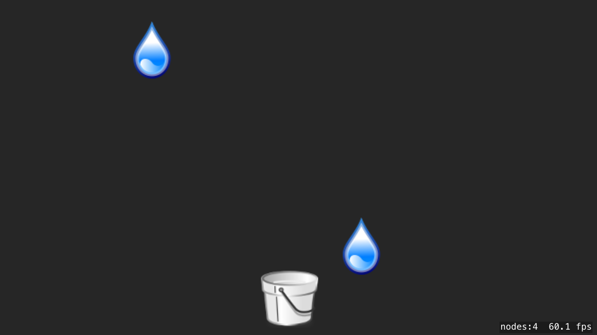
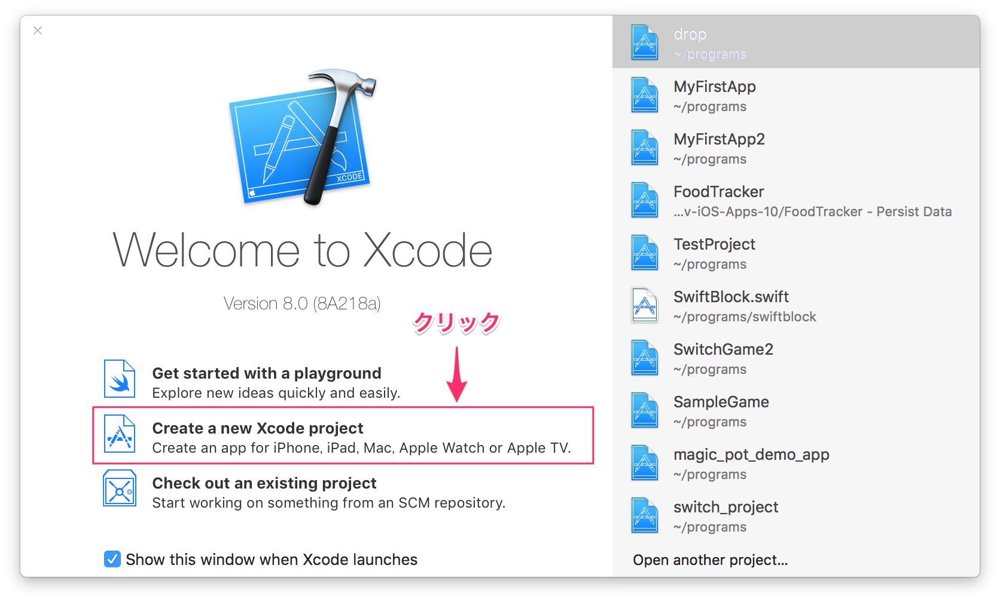
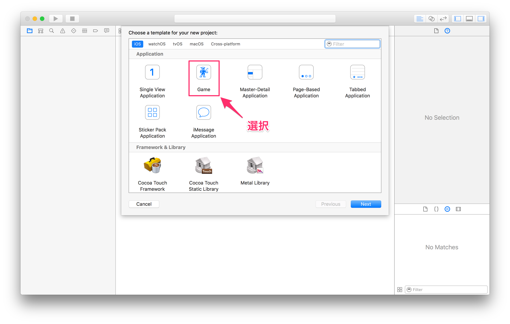
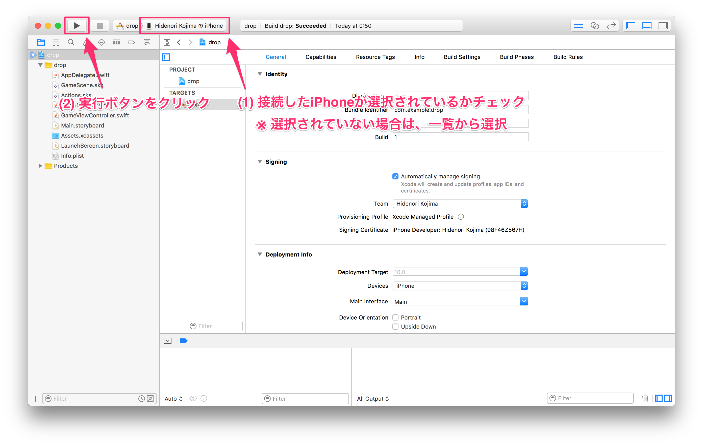
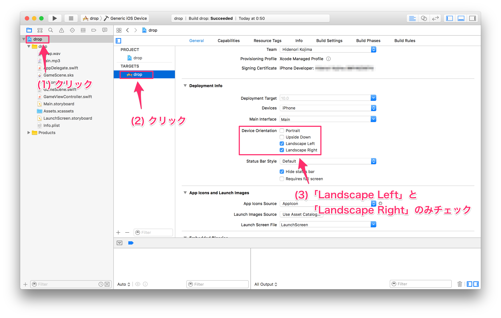
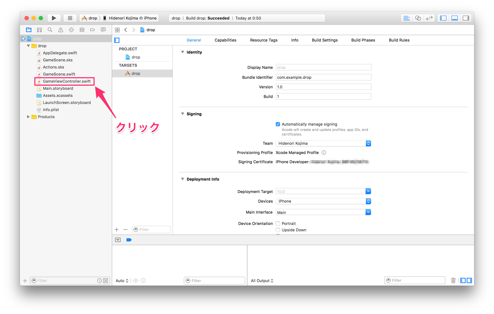
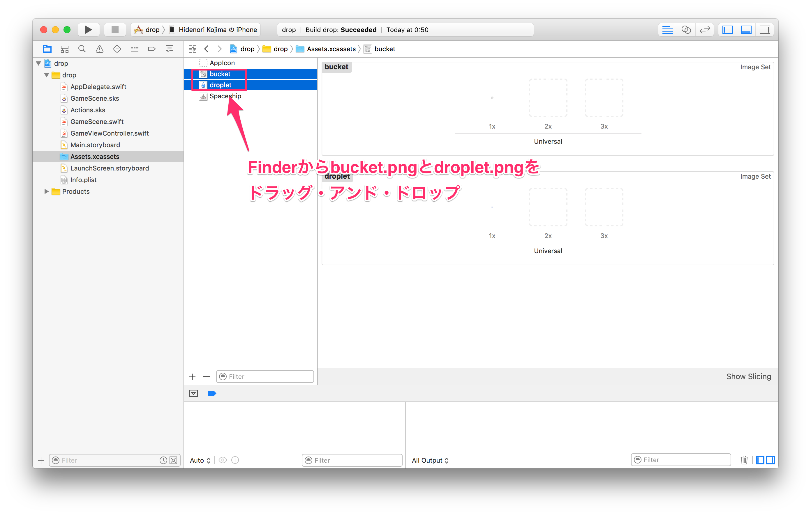
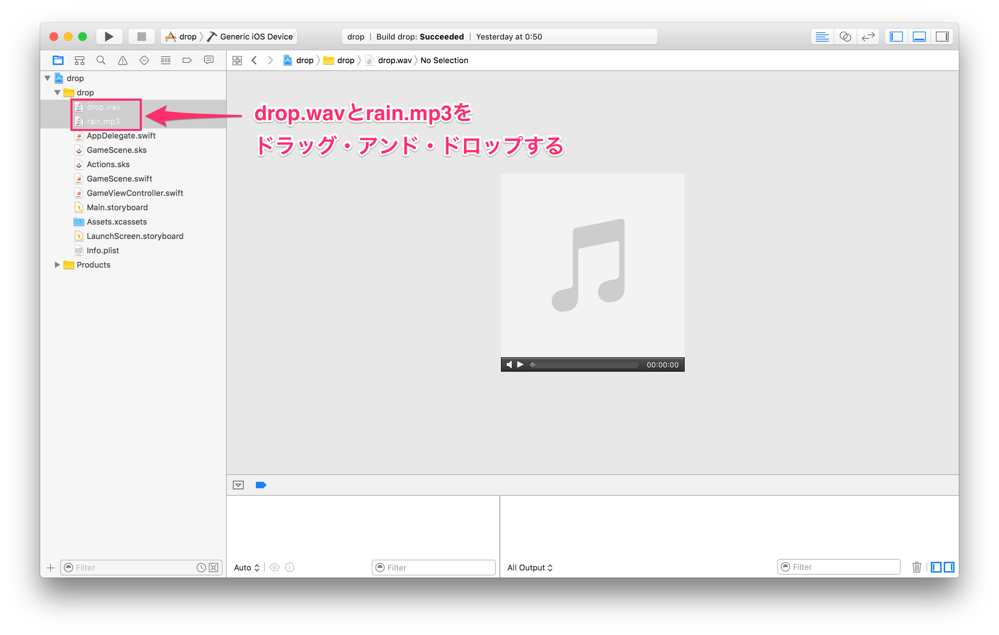
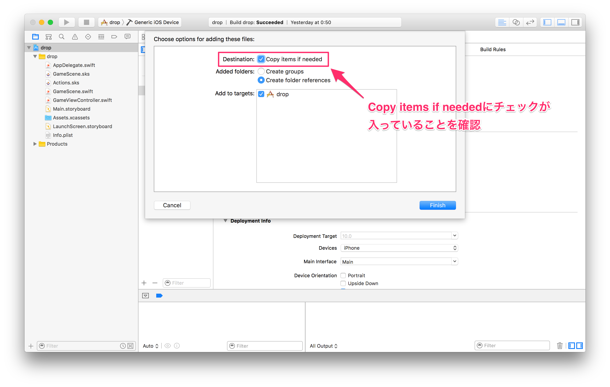

# ゲーム完成イメージ



画面をタップしてバケツを移動し、落ちてくる雨をキャッチするゲーム！

参考元: <a href="https://github.com/libgdx/libgdx/wiki/A-simple-game">A simple game (ligGDX)</a>

## 準備
1. Xcode(バージョン8以上)をインストール
2. <a href="./assets.zip">ゲームアセット(assets.zip)</a>をダウンロードして展開する

## SpriteKitプロジェクトを作成
1. Xcodeを起動し、「Create a new Xcode project」をクリック(画像参照)<br/>

2. 作成するプロジェクトのテンプレートとして、「Game」を選択(画像参照)<br/>

3. プロジェクトの情報として、以下を入力する:
 * Product name: __drop__
 * Team: <span style="color: #e74c3c;">適宜選択</span>
 * Organization Name: <span style="color: #e74c3c;">適宜選択 (例: 氏名「Hidenori Kojima」等)</span>
 * Organization Identifier: __com.example__
 * Language: __Swift__
 * Game Category: __SpriteKit__
 * Devices: __iPhone__
 * Integrate GameplayKit: チェックを外す
 * Include Unit Tests: チェックを外す
 * Include UI Tests: チェックを外す
4. 最後にプロジェクトの保存先を指定して、「Create」ボタンをクリックしてプロジェクトを作成

## 実機での実行確認
1. iPhoneをLightningケーブルでMacに接続する
2. 実行ボタンをクリック
3. 接続したiPhoneでサンプルのゲームが実行できることを確認する<br/>
(画像参照)<br/>


## 画面表示方向の設定
下図に従って、画面の表示方向を横長(Landscape Left/Landscape Right)のみにする:<br/>


## `GameViewController`クラスの設定
1. プロジェクトナビゲーター中の__GameViewController.swift__をクリック(画像参照)<br/>

2. 右側のソースコードエディタで、`viewDidLoad`メソッド中の`scene.scaleMode = .aspectFill`を`scene.scaleMode = .resizeFill`に書き換える:
    ```swift
    override func viewDidLoad() {
        super.viewDidLoad()

        if let view = self.view as! SKView? {
            // Load the SKScene from 'GameScene.sks'
            if let scene = SKScene(fileNamed: "GameScene") {
                // Set the scale mode to scale to fit the window
                scene.scaleMode = .resizeFill

                // Present the scene
                view.presentScene(scene)
            }

            view.ignoresSiblingOrder = true

            view.showsFPS = true
            view.showsNodeCount = true
        }
    }
    ```

## ゲームアセットの追加
1. プロジェクトナビゲーター中の__Assets.xcassets__をクリック
2. 「準備」の2でダウンロードして展開しておいたフォルダから__bucket.png__と__droplet.png__を選択し、Assets.xcassetsにドラッグ・アンド・ドロップしてゲームアセットとして追加する(画像参照)<br/>

3. 続いて、フォルダから__drop.wav__と__rain.mp3__を選択し、プロジェクトナビゲーター中のdropフォルダの下にドラッグ・アンド・ドロップする(画像参照)<br/>

4. 「Copy items if needed」にチェックが入っていることを確認して、「Finish」ボタンをクリックする(画像参照)<br/>


## `GameScene`クラスの変更 (ゲームコードの実装)
### クリーンアップ
サンプルコードを削除し、一旦以下の状態にする:
    ``` swift
    //
    //  GameScene.swift
    //  drop
    //
    //  Created by Hidenori Kojima on 2016/10/25.
    //  Copyright © 2016年 Hidenori Kojima. All rights reserved.
    //

    import SpriteKit
    import GameplayKit

    class GameScene: SKScene {

        override func didMove(to view: SKView) {
        }


        override func touchesBegan(_ touches: Set<UITouch>, with event: UIEvent?) {
        }

        override func update(_ currentTime: TimeInterval) {
            // Called before each frame is rendered
        }
    }
    ```
### ゲームアセットの読み込み
1. コードを以下のように追加し、ゲームで使用するアセット(画像)を読み込む:
    ``` swift
    // ..以上少省略.. ※この行は書きません

    class GameScene: SKScene {

        private var droplet: SKSpriteNode!
        private var bucket : SKSpriteNode!

        override func didMove(to view: SKView) {

            droplet = SKSpriteNode(imageNamed: "droplet")
            droplet.zPosition = 10  // 水滴がバケツより上に表示されるようにする

            bucket = SKSpriteNode(imageNamed: "bucket")
            bucket.position.x = 0                         // バケツを横方向の中央に配置する
            bucket.position.y = -size.height * 0.5 + 40   // バケツを画面下端から少し上に配置する
            addChild(bucket)

            // 雨のBGMを繰り返し再生し続ける
            run(SKAction.repeatForever(SKAction.playSoundFileNamed("rain.mp3", waitForCompletion: true)))
        }

        // ..以下少省略.. ※この行は書きません
    ```
2. 実行すると、バケツが画面中央下に表示されることが確認できます。水滴はまだ表示されません

### バケツをタップで移動させる
1. `touchesBegan`メソッドを以下のように変更します:<br/>
``` swift
override func touchesBegan(_ touches: Set<UITouch>, with event: UIEvent?) {
    if let touch = touches.first {
        let position = touch.location(in: self)
        bucket.position.x = position.x
    }
}
```
2. 実行すると、バケツがタップした位置に移動することを確認できます

### 水滴を追加する
1. `GameScene`クラスの末尾に`spawnRaindrop`メソッドを追加します:
    ``` swift
        // ..以上省略..
        override func update(_ currentTime: TimeInterval) {
            // Called before each frame is rendered
        }

        // 新しい水滴を追加する
        private func spawnRaindrop() {
            // 水滴ノードをコピーする
            if let dl = droplet.copy() as? SKSpriteNode {
                // 水滴を配置する横方向の位置をランダムに生成する
                let x = CGFloat(arc4random_uniform(UInt32(size.width))) - size.width * 0.5
                dl.position.x = x
                dl.position.y = size.height * 0.5 + 32  // 水滴の縦方向の位置を画面上端にする
                // 画面下端まで2秒間で移動し、その後画面から削除するようにアクションを設定する
                dl.run(SKAction.sequence([SKAction.moveBy(x:  0, y: -size.height - 64, duration: 2.0),
                                          SKAction.removeFromParent()]))
                addChild(dl)
            }
        }
    }
    ```
2. `didMove(to view:_)`メソッドの末尾に以下のように変更します:
    ``` swift
    override func didMove(to view: SKView) {

        droplet = SKSpriteNode(imageNamed: "droplet")
        droplet.zPosition = 10  // 水滴がバケツより上に表示されるようにする

        bucket = SKSpriteNode(imageNamed: "bucket")
        bucket.position.x = 0                         // バケツを横方向の中央に配置する
        bucket.position.y = -size.height * 0.5 + 40   // バケツを画面下端から少し上に配置する
        addChild(bucket)

        // 雨のBGMを繰り返し再生し続ける
        run(SKAction.repeatForever(SKAction.playSoundFileNamed("rain.mp3", waitForCompletion: true)))

        // 1秒毎にspawnRaindropメソッドを実行して水滴を追加する
        run(SKAction.repeatForever(
                SKAction.sequence([
                    SKAction.run { self.spawnRaindrop() },
                    SKAction.wait(forDuration: 1.0)
                ])))    
    }
    ```
3. 実行すると、水滴が1秒毎に画面上から降ってくることが確認できますが、水滴とバケツが触れてもまだ何も起こりません

### 水滴とバケツの衝突判定
1. bucket(バケツ)とdroplet(水滴)に以下のように衝突設定を行います:
    ``` swift
    // ..以上省略..
    class GameScene: SKScene, SKPhysicsContactDelegate {

        private let dropletCategory: UInt32 = 0x1 << 1  // 水滴の衝突判定カテゴリを10(2進数)にする
        private let bucketCategory: UInt32 = 0x1 << 0   // バケツの衝突判定カテゴリを01(2進数)にする

        private var droplet: SKSpriteNode!
        private var bucket : SKSpriteNode!

        override func didMove(to view: SKView) {

            // contactDelegateを自分自身にして、衝突を検出できるようにする
            physicsWorld.contactDelegate = self

            droplet = SKSpriteNode(imageNamed: "droplet")
            droplet.zPosition = 10  // 水滴がバケツより上に表示されるようにする
            // 64x64の正方形サイズの物理ボディーを水滴に設定する
            droplet.physicsBody = SKPhysicsBody(rectangleOf: CGSize(width: 64.0, height: 64.0))
            droplet.physicsBody?.affectedByGravity = false  // 重力の影響は受けないように設定
            droplet.physicsBody?.categoryBitMask = dropletCategory  // 物理ボティーに水滴の衝突判定カテゴリを設定
            droplet.physicsBody?.contactTestBitMask = bucketCategory  // 衝突検出対象をバケツの衝突判定カテゴリに設定
            droplet.physicsBody?.collisionBitMask = 0　// 衝突しても衝突相手からの力を受けないように設定

            bucket = SKSpriteNode(imageNamed: "bucket")
            bucket.position.x = 0                         // バケツを横方向の中央に配置する
            bucket.position.y = -size.height * 0.5 + 40   // バケツを画面下端から少し上に配置する
            // 64x64の正方形サイズの物理ボディーをバケツに設定する
            bucket.physicsBody = SKPhysicsBody(rectangleOf: CGSize(width: 64.0, height: 64.0))
            bucket.physicsBody?.affectedByGravity = false  // 重力の影響は受けないように設定
            bucket.physicsBody?.categoryBitMask = bucketCategory  // 物理ボティーにバケツの衝突判定カテゴリを設定
            bucket.physicsBody?.contactTestBitMask = dropletCategory  // 衝突検出対象を水滴の衝突判定カテゴリに設定
            bucket.physicsBody?.collisionBitMask = 0　// 衝突しても衝突相手からの力を受けないように設定
            addChild(bucket)

            // 雨のBGMを繰り返し再生し続ける
            run(SKAction.repeatForever(SKAction.playSoundFileNamed("rain.mp3", waitForCompletion: true)))

            // 1秒毎に水滴を追加する
            run(SKAction.repeatForever(
                    SKAction.sequence([
                        SKAction.run { self.spawnRaindrop() },
                        SKAction.wait(forDuration: 1.0)
                    ])))    
        }
        // ..以下省略..
    ```
2. `didBegin(_ contact:_)`メソッドを追加して、水滴とバケツが衝突した際の処理を行う:
    ``` swift
        // ..以上省略..
        override func update(_ currentTime: TimeInterval) {
            // Called before each frame is rendered
        }

        // バケツと水滴が衝突した際に呼び出される
        func didBegin(_ contact: SKPhysicsContact) {
            var droplet: SKNode!
            // 衝突した2つの物体(bodyA/bodyB)のうちどちらが水滴なのかをチェックする
            if contact.bodyA.categoryBitMask == dropletCategory {
                droplet = contact.bodyA.node!
            } else if contact.bodyB.categoryBitMask == dropletCategory {
                droplet = contact.bodyB.node!
            }
            if droplet != nil {
                // 水滴の効果音を再生し、水滴を画面から取り除く
                droplet.run(SKAction.sequence([
                                SKAction.playSoundFileNamed("drop.wav", waitForCompletion: false),
                                SKAction.removeFromParent()
                            ]))
            }
        }

        private func spawnRaindrop() {
        // ..以下省略..
    ```
3. 実行し、バケツと水滴が触れると音が鳴って水滴が消えることが確認できます

以上でゲームの完成です！

## 全ソースコード
これまでにプログラムしたコードの全体を以下に掲載します:
### `GameViewController.swift`
``` swift
//
//  GameViewController.swift
//  drop
//
//  Created by Hidenori Kojima on 2016/10/25.
//  Copyright © 2016年 Hidenori Kojima. All rights reserved.
//

import UIKit
import SpriteKit
import GameplayKit

class GameViewController: UIViewController {

    override func viewDidLoad() {
        super.viewDidLoad()

        if let view = self.view as! SKView? {
            // Load the SKScene from 'GameScene.sks'
            if let scene = SKScene(fileNamed: "GameScene") {
                // Set the scale mode to scale to fit the window
                scene.scaleMode = .resizeFill

                // Present the scene
                view.presentScene(scene)
            }

            view.ignoresSiblingOrder = true

            view.showsFPS = true
            view.showsNodeCount = true
        }
    }

    override var shouldAutorotate: Bool {
        return true
    }

    override var supportedInterfaceOrientations: UIInterfaceOrientationMask {
        if UIDevice.current.userInterfaceIdiom == .phone {
            return .allButUpsideDown
        } else {
            return .all
        }
    }

    override func didReceiveMemoryWarning() {
        super.didReceiveMemoryWarning()
        // Release any cached data, images, etc that aren't in use.
    }

    override var prefersStatusBarHidden: Bool {
        return true
    }
}
```

### `GameScene.swift`
``` swift
//
//  GameScene.swift
//  drop
//
//  Created by Hidenori Kojima on 2016/10/25.
//  Copyright © 2016年 Hidenori Kojima. All rights reserved.
//

import SpriteKit
import GameplayKit
import CoreMotion

class GameScene: SKScene, SKPhysicsContactDelegate {

    private let dropletCategory: UInt32 = 0x1 << 1  // 水滴の衝突判定カテゴリを10(2進数)にする
    private let bucketCategory: UInt32 = 0x1 << 0   // バケツの衝突判定カテゴリを01(2進数)にする

    private var droplet: SKSpriteNode!
    private var bucket : SKSpriteNode!

    override func didMove(to view: SKView) {

        // contactDelegateを自分自身にして、衝突を検出できるようにする
        physicsWorld.contactDelegate = self

        droplet = SKSpriteNode(imageNamed: "droplet")
        droplet.zPosition = 10  // 水滴がバケツより上に表示されるようにする
        // 64x64の正方形サイズの物理ボディーを水滴に設定する
        droplet.physicsBody = SKPhysicsBody(rectangleOf: CGSize(width: 64.0, height: 64.0))
        droplet.physicsBody?.affectedByGravity = false  // 重力の影響は受けないように設定
        droplet.physicsBody?.categoryBitMask = dropletCategory  // 物理ボティーに水滴の衝突判定カテゴリを設定
        droplet.physicsBody?.contactTestBitMask = bucketCategory  // 衝突検出対象をバケツの衝突判定カテゴリに設定
        droplet.physicsBody?.collisionBitMask = 0   // 衝突しても衝突相手からの力を受けないように設定

        bucket = SKSpriteNode(imageNamed: "bucket")
        bucket.position.x = 0                         // バケツを横方向の中央に配置する
        bucket.position.y = -size.height * 0.5 + 40   // バケツを画面下端から少し上に配置する
        // 64x64の正方形サイズの物理ボディーをバケツに設定する
        bucket.physicsBody = SKPhysicsBody(rectangleOf: CGSize(width: 64.0, height: 64.0))
        bucket.physicsBody?.affectedByGravity = false  // 重力の影響は受けないように設定
        bucket.physicsBody?.categoryBitMask = bucketCategory  // 物理ボティーにバケツの衝突判定カテゴリを設定
        bucket.physicsBody?.contactTestBitMask = dropletCategory  // 衝突検出対象を水滴の衝突判定カテゴリに設定
        bucket.physicsBody?.collisionBitMask = 0    // 衝突しても衝突相手からの力を受けないように設定
        addChild(bucket)

        // 雨のBGMを繰り返し再生し続ける
        run(SKAction.repeatForever(SKAction.playSoundFileNamed("rain.mp3", waitForCompletion: true)))

        // 1秒毎に水滴を追加する
        run(SKAction.repeatForever(
                SKAction.sequence([
                    SKAction.run { self.spawnRaindrop() },
                    SKAction.wait(forDuration: 1.0)
                ])))    
    }

    override func touchesBegan(_ touches: Set<UITouch>, with event: UIEvent?) {
        if let touch = touches.first {
            let position = touch.location(in: self)
            bucket.position.x = position.x
        }
    }

    override func update(_ currentTime: TimeInterval) {
        // Called before each frame is rendered
    }

    // バケツと水滴が衝突した際に呼び出される
    func didBegin(_ contact: SKPhysicsContact) {
        var droplet: SKNode!
        // 衝突した2つの物体(bodyA/bodyB)のうちどちらが水滴なのかをチェックする
        if contact.bodyA.categoryBitMask == dropletCategory {
            droplet = contact.bodyA.node!
        } else if contact.bodyB.categoryBitMask == dropletCategory {
            droplet = contact.bodyB.node!
        }
        if droplet != nil {
            // 水滴の効果音を再生し、水滴を画面から取り除く
            droplet.run(SKAction.sequence([
                            SKAction.playSoundFileNamed("drop.wav", waitForCompletion: false),
                            SKAction.removeFromParent()
                        ]))
        }
    }

    // 新しい水滴を追加する
    private func spawnRaindrop() {
        // 水滴ノードをコピーする
        if let dl = droplet.copy() as? SKSpriteNode {
            // 水滴を配置する横方向の位置をランダムに生成する
            let x = CGFloat(arc4random_uniform(UInt32(size.width))) - size.width * 0.5
            dl.position.x = x
            dl.position.y = size.height * 0.5 + 32  // 水滴の縦方向の位置を画面上端にする
            // 画面下端まで2秒間で移動し、その後画面から削除するようにアクションを設定する
            dl.run(SKAction.sequence([SKAction.moveBy(x:  0, y: -size.height - 64, duration: 2.0),
                                      SKAction.removeFromParent()]))
            addChild(dl)
        }
    }
}
```

``` swift
override func update(_ currentTime: TimeInterval) {
    if bucket.position.x < -size.width * 0.5 {
        bucket.position.x = -size.width * 0.5
    }
    if bucket.position.x > size.width * 0.5 {
        bucket.position.x = size.width * 0.5
    }
    if let data = motionManager.accelerometerData {
        if fabs(data.acceleration.y) > 0.2 {
            if UIApplication.shared.statusBarOrientation == .landscapeLeft {
                bucket.position.x += 5 * (data.acceleration.y > 0 ? 1: -1)
            } else {
                bucket.position.x -= 5 * (data.acceleration.y > 0 ? 1: -1)
            }
        }
    }
}
```


## ゲームアセット
* 雨粒画像
 * https://www.box.com/s/peqrdkwjl6guhpm48nit
* バケツ画像
 * https://www.box.com/s/605bvdlwuqubtutbyf4x
* 水滴が落ちる音 ([CC 3.0](https://creativecommons.org/licenses/by/3.0/))
 * http://www.freesound.org/people/junggle/sounds/30341/
* 雨の音 ([CC 3.0](https://creativecommons.org/licenses/by/3.0/))
 * http://www.freesound.org/people/acclivity/sounds/28283/
